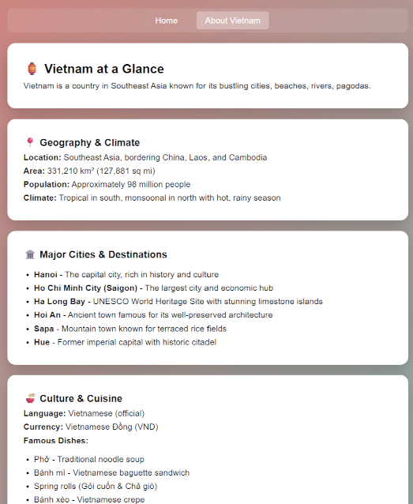

# Hello Vietnam
A mobile-friendly prototype app for exploring Vietnam.

<H2>Landing</H2>
 

<H2>At a Glance</H2>

## Overview

**Purpose**: Mobile-first prototype for exploring Vietnam's destinations and culture.

**Approach**: Simple, responsive web app optimized for mobile devices.

## What This Demonstrates

- Mobile-responsive design patterns.
- Clean, tourism-focused UX design.
- Form submission and email processing (with debug output).

## Tech Stack

PHP, HTML, CSS, JavaScript.

## Quick Start
1. Clone the repo and run it locally using PHP's built-in server.
2. Alternatively, you can import the repo into Replit and run it there using a PHP Web Server instance

## 🏮 Hello Vietnam - Demo

🌐 **[View Live Demo](http://hello-vietnam-demo.atwebpages.com/)**
